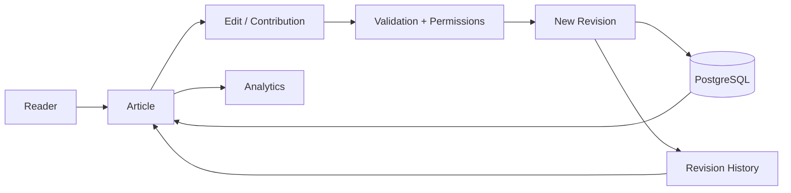
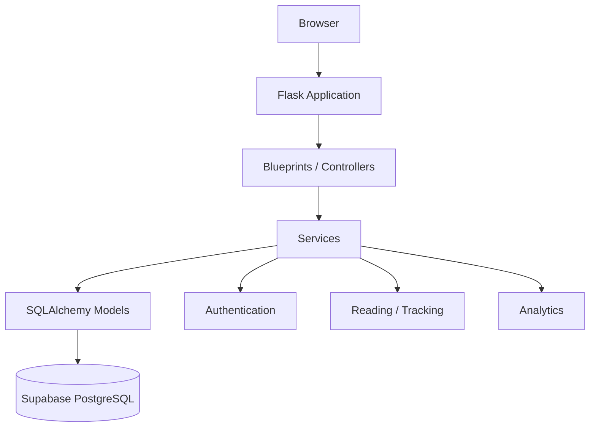

# 🌍 TerraVault

> **A community-driven knowledge platform built for articles, discovery, and the history behind every edit.**

TerraVault is a full-stack knowledge and community platform combining the familiar structure of an encyclopedia with a real content-management system. It is designed around **structured knowledge, human contribution, revision history, roles, and useful analytics** rather than a collection of static pages.

It is one of the larger platform projects in the **.dot** ecosystem.

## ✨ What TerraVault Provides

- 📚 **Encyclopedic articles** organized into structured categories.
- ✍️ **Content management** for creating and editing knowledge.
- 🕘 **Revision history** that records article versions instead of silently overwriting previous work.
- 🔐 **Authentication and role-aware access** for protected platform operations.
- 🧭 **Dynamic table of contents** generated from article headings with navigable anchors.
- 📊 **Admin analytics** for understanding platform activity and content metrics.
- 🧱 **Clean architecture** separating routes, services, models, templates, and utilities.
- 🗃️ **PostgreSQL-backed persistence** through Supabase, with migrations managed by Alembic/Flask-Migrate.
- 🐳 **Containerized deployment** through Docker and Docker Compose.
- ⚙️ **Production-oriented setup** with Gunicorn and GitHub Actions CI.

## 🧠 The Core Idea

```text
Discover → Read → Understand → Contribute → Review / Revise → Preserve history → Grow knowledge
```

## 🔄 Knowledge & Revision Flow



**How to read it:** an edit becomes a new revision rather than silently destroying the previous state. The stored history feeds both recovery/provenance and platform analytics.

## 🏗️ Request Architecture



## 🧩 Project structure

```text
TerraVault/
├── run.py
├── app/
│   ├── __init__.py
│   ├── config.py
│   ├── extensions.py
│   ├── models/
│   ├── services/
│   ├── utils/
│   └── blueprints/
├── templates/
├── static/
├── migrations/
├── seed.py
└── README.md
```

## 🛠️ Tech Stack

| Layer | Technology |
|---|---|
| Framework | Flask 3 |
| Templates | Jinja2 |
| Authentication | Flask-Login |
| Forms / Security | Flask-WTF, CSRFProtect |
| ORM | SQLAlchemy |
| Migrations | Alembic / Flask-Migrate |
| Database | Supabase PostgreSQL |
| Analytics | Chart.js |
| Production server | Gunicorn |
| Deployment | Docker / Docker Compose |
| CI | GitHub Actions |

## 🚀 Run Locally

```bash
git clone https://github.com/cser-utkarsh-raj/TerraVault.git
cd TerraVault
python -m venv venv
# Windows: venv\Scripts\activate
# macOS/Linux: source venv/bin/activate
pip install -r requirements.txt
flask db upgrade
python seed.py
python run.py
```

Production-style local server:

```bash
gunicorn -b 127.0.0.1:8000 run:app
```

Docker:

```bash
docker-compose up --build
```

## 🔐 Environment

```env
FLASK_APP=run.py
FLASK_ENV=development
SECRET_KEY=your-secure-secret
DATABASE_URL=postgresql://...
```

Never commit real secrets or `.env` files.

## 🗺️ Product Direction

TerraVault began as an encyclopedia-style knowledge platform and is designed with room to grow into a broader **community knowledge network** — where people can discover topics, contribute, discuss, revise, and build durable collections of knowledge.

> **TerraVault · Knowledge worth keeping.**
>
> **Presented by .dot**
